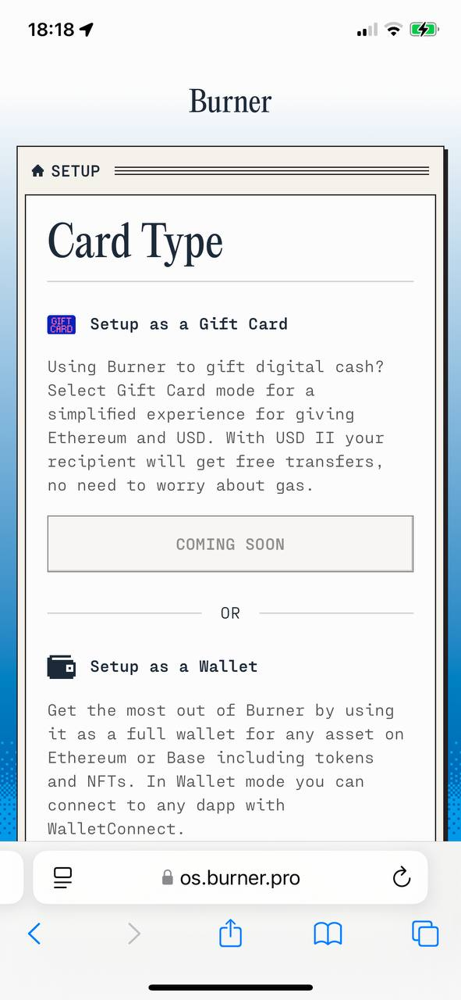
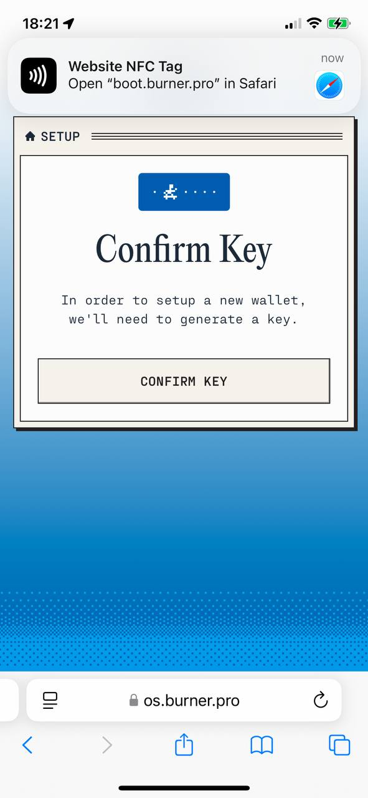
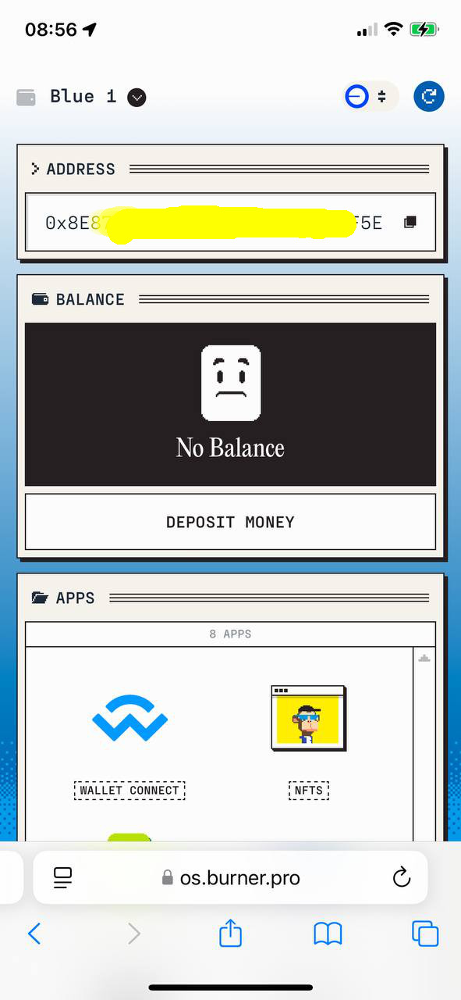
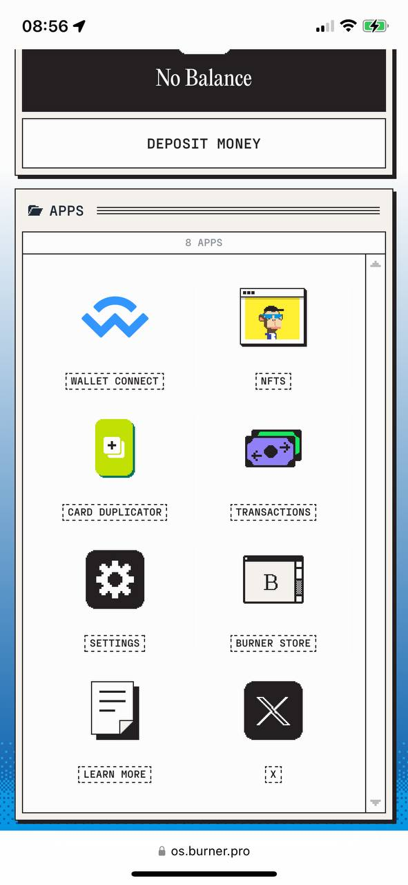

# Burner.pro NFC Card Review (WIP)

[burner.pro](https://burner.pro/) provide Ethereum wallet functionality on a [NFC](https://en.wikipedia.org/wiki/Near-field_communication) card

<kbd></kbd>

[UseBurner](https://x.com/useburner) announced their launch on X on Nov 14 2024

<kbd></kbd>

And my Burner cards have just arrived

<kbd></kbd>

So this is my review of these cards.

### Table Of Contents

* [New Ethereum Wallet Setup](#new-ethereum-wallet-setup)
* [Duplicating A Card](#duplicating-a-card)

 

---

#### New Ethereum Wallet Setup

Swipe your NFC card to the phone and the website [os.burner.pro](https://os.burner.pro/) is loaded. During this setup you may be prompted to re-swipe your NFC card

<kbd></kbd>

I selected "Setup as a Wallet"

<kbd></kbd>

Generate key

<kbd></kbd>

Add some randomness

<kbd></kbd>

Confirm

<kbd></kbd>

Setup a PIN code

<kbd></kbd>

Name your wallet

<kbd></kbd>

New wallet has been setup

<kbd></kbd>

Burner OS menu

<kbd></kbd>

 

---

#### Duplicating A Card

Select CARD DUPLICATION from the Burner OS menu. Swipe the source card

<kbd></kbd>

Swipe the duplicate card

<kbd></kbd>

Enter your PIN code

<kbd></kbd>

Swipe the source and duplicate cards a few more times and the new card is now a duplicate.

<kbd></kbd>
