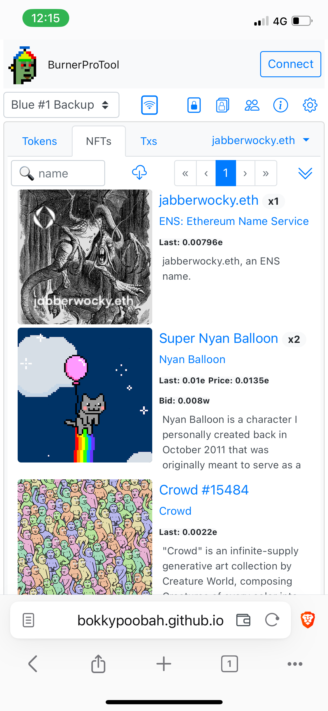
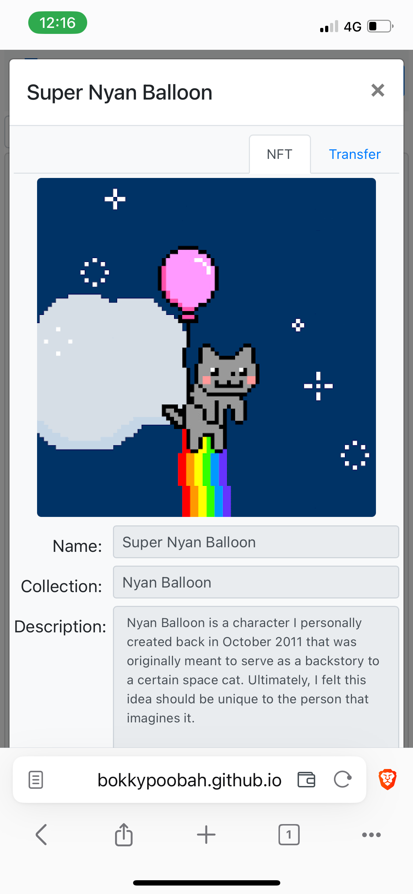
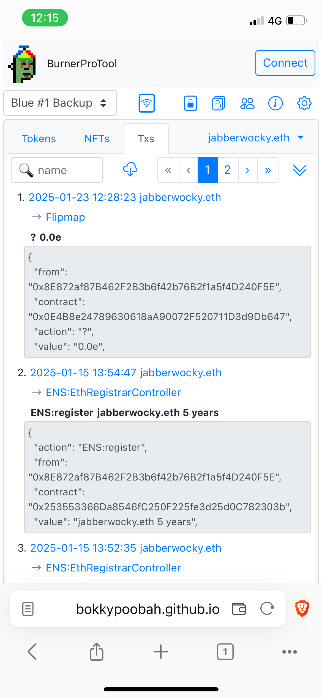

# Burner.pro NFC Card Tool (WIP)

This repo initially started as a review of [burner.pro](https://burner.pro/), but some tools need to be built to provide alternative access to this card, if the original developer's website were to become unavailable.

See the [Burner.pro Review](./Review.md) (WIP).

We are not affiliated with burner.pro . This tool is under development, so test it with small amounts first.

TODO:
* Complete modalNewAddress
* Addresses - transferFrom, transferTo, transfer permissions?
* Transfer out ETH
* Wrap and unwrap ETH?
* Transfer out ERC-20
* Transfer out ERC-721/1155 - select address from 'eoa' and 'nfccard' addresses
* Transactions - summarise using flows
* Tidy address links
* Sync progress - handle errors
* Sync CryptoCompare data and convert ETH amounts to desired currency
* Handle lack of web3 connection gracefully
* ENS name syncing
* Big tidy

 

---

### Burner.pro Tool

This dapp uses [libhalo.js v1.10.11](https://github.com/arx-research/libhalo/releases/download/libhalo-v1.10.11/libhalo.js) to interact with burner.pro NFC card.

Load on NFC reader enabled mobile phone, with Burner.pro NFC card: https://bokkypoobah.github.io/BurnerProTool/

#### Sample Screens

Intro page

<kbd></kbd>

Click on the [Scan NFC card] button

<kbd></kbd>

After scanning my first NFC card

<kbd></kbd>

Click to the [Cards] tab to name the card

<kbd></kbd>

Click on the address to name the address

<kbd></kbd>

After scanning my second NFC card

<kbd></kbd>

Click on the [Card] on my first NFC card. Note that this card has been duplicated.

<kbd></kbd>

Click on the [Card] on my second NFC card. Note that this card is the duplicate of the first card

<kbd></kbd>

Click to the [Config] tab and enter your Etherscan and CryptoCompare API keys.

You can click on [Insert Test Data] to test this application with my NFC card addresses above.

<kbd></kbd>

Click on the [Card] tab and click on the [Download] icon to view the fungible tokens

<kbd></kbd>

Click on the [NFTs] tab to view the list of owned NFTs

<kbd></kbd>

Click on an NFT image to view the NFT details

<kbd></kbd>

Click on the Transfer tab to transfer your NFT to a new address

<kbd></kbd>

Click on the [Txs] tab and click on the [Download] icon to view the transactions

<kbd></kbd>

Click on the [Addresses] tab to view your addresses, including ERC-20, ERC-721 and ERC-1155 contracts.

<kbd></kbd>

 

---

#### References

* [LibHaLo](https://github.com/arx-research/libhalo)

 

 

Enjoy!

(c) BokkyPooBah / Bok Consulting Pty Ltd 2025. The MIT License
